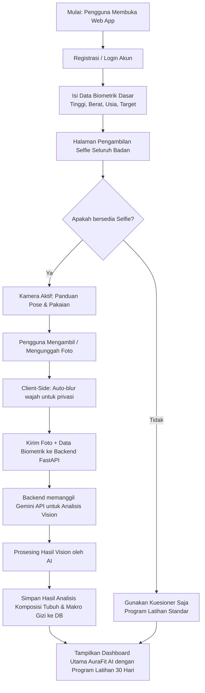
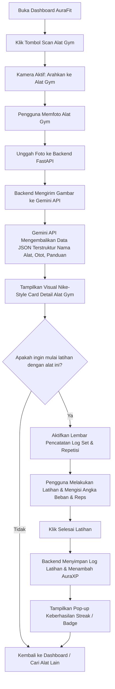
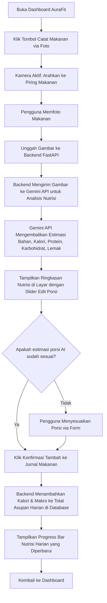

# Alur Pengguna (User Flow Document)
## AuraFit AI - Personal Trainer Fitness/Gym Assistant

Dokumen ini memetakan alur interaksi pengguna (User Flow) dalam bentuk diagram alur langkah demi langkah menggunakan **Mermaid.js**. Diagram ini dirancang untuk memandu LLM atau pengembang frontend dalam membangun rute navigasi dan antarmuka pengguna (UI) yang mulus.

---

## 1. Alur Orientasi Pengguna Baru (Onboarding & Full-Body Selfie Flow)
Alur ini dilewati pengguna saat pertama kali masuk ke aplikasi untuk mendapatkan analisis tubuh dan program latihan perdana mereka.

---

## 2. Alur Deteksi Alat Gym & Pencatatan Latihan (Gym Equipment Vision Flow)
Alur harian ketika pemula berdiri di depan alat gym, bingung cara menggunakannya, lalu ingin merekam aktivitas latihan mereka.

---

## 3. Alur Deteksi Makanan & Pelacakan Nutrisi (Food Nutrition Vision Flow)
Alur di mana pengguna memfoto makanan mereka untuk melacak asupan kalori dan makronutrisi harian secara otomatis.

